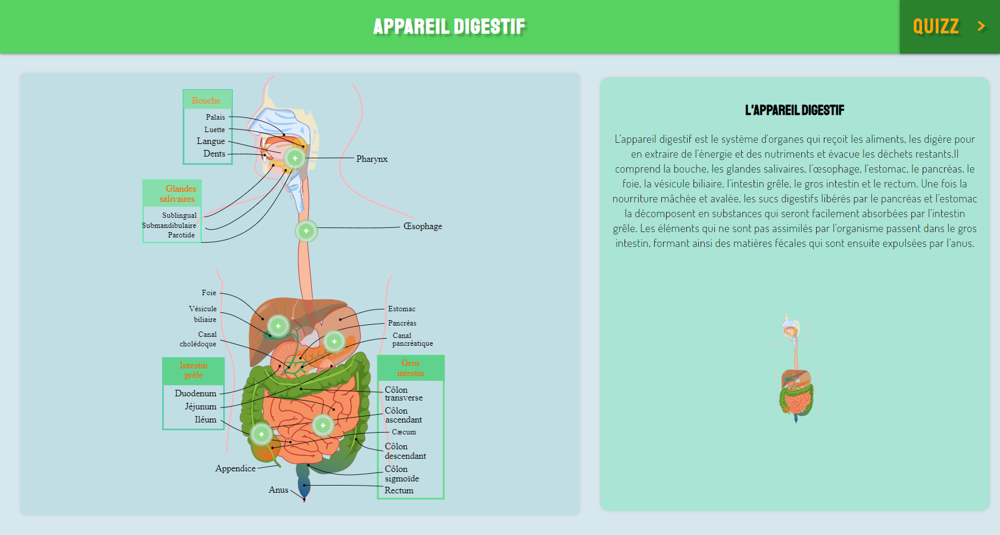
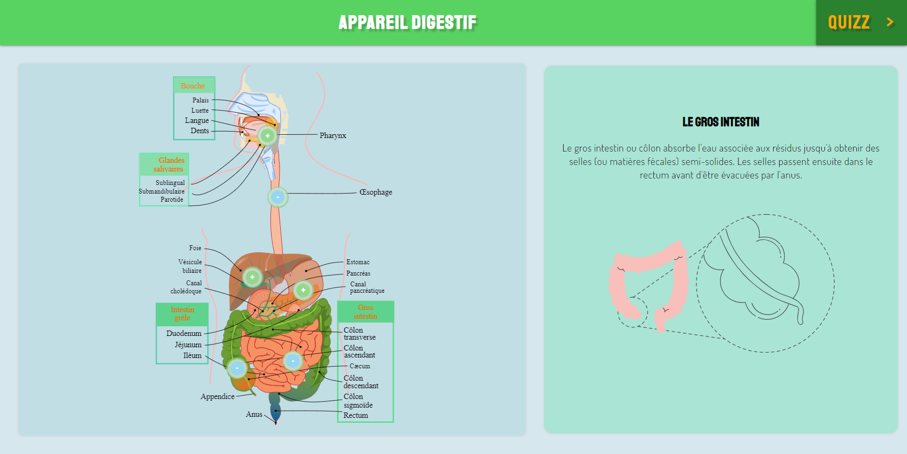
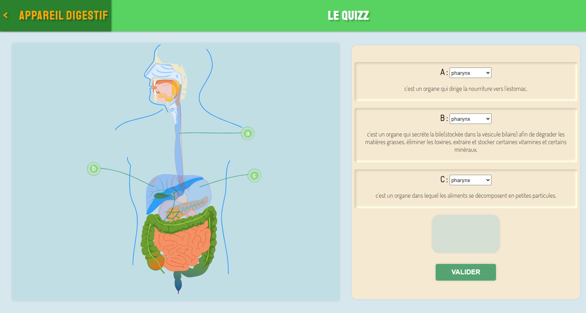

# Human digestive system

## What is The Human digestive system?

The gastrointestinal system (or digestive system ) is the system of organs of multicellular animals which takes food, digests it to extract energy and nutrients , and expels the surplus fecal matter ..

Digestion is important for breaking down food into nutrients, which the body uses for energy, cell growth, and cell repair.

## Project Overview

This project is important in facilitating the approach taken to teach in our localschools in Africa using technology. Leaners can properly understand how the gut works by using this illustrative interface.

# User Interface

# Hosted Link:

:point_down: :point_down: :point_down:

[Click Here!](https://lesprogrammeurbmical.netlify.app/)

Made with :heart: by @LesCodersPro during the sevenKids code program August 2021